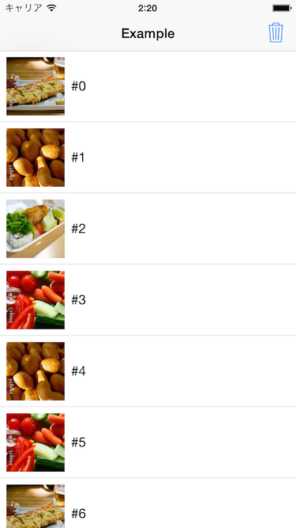

# USGImageLoader
USGImageLoader is an asynchronous image downloader with 2-layered caching mechanism for iOS. Written in Objective-C.
This is effective solution for asynchronous image loading with UITableView / UICollectionView.

- An asynchronous / concurrent image downloader with NSURLSession
- 2-layered image caching, disk and memory caches.
- Customizes concurrent count with NSURLSessionConfiguration
- Tasks are appendable or cancellable when needed. Useful to visible UITableViewCells



# Usage

USGImageCache contains these classes:

- **USGImageLoader**: Image loader class.
- **USGImageDownloadManager**: Manages downloading task with NSURLSession.
- **USGImageCache**: 2-layered image cache storage.
- **USGImageCacheManager**: Manages image cahces.
- **USGNetworkIndicatorManager**: Manages network activity indicator on status bar.

## 1. Initialize image loader

Delegate is needed. If specifying cache to nil, set default / shared image cache.

```
USGImageLoader *imageLoader = [[USGImageLoader alloc] initWithCache:[USGImageCache defaultImageCache] delegate:self];
```

## 2. Preparation of image URL(s)

URLs are used as key for downloading tasks. Recommended to retains them as property or other solutions.

```
self.URLs = @[].mutableCopy;
for (int i=0; i<200; i++) {
	[self.URLs addObject:[NSURL URLWithString:[NSString stringWithFormat:@"http://example/image%d.jpg", i]]];
}
```

### Note:
URLs are converted to lowercase strings when used in USGImageLoader.

## 3. Start loading images

To start, call this method with image URL. Any existing other tasks will be cancelled.

```
[imageLoader loadImages:@[URL]];
```

If call this method when will load additional, existing tasks will not be cancelled.

```
[imageLoader loadImagesAppendingTasks:@[URL]]
```

### Example for UITableView

Loading image when displaying UITableViewCell.

```
- (void)tableView:(UITableView *)tableView willDisplayCell:(TableViewCell *)cell forRowAtIndexPath:(NSIndexPath *)indexPath
{
	cell.image = nil;
	
	NSURL *URL = self.URLs[indexPath.row];
	[self.imageLoader loadImagesAppendingTasks:@[URL]];
}
```

## 4. Cancelling existing tasks

To cancel, call this method with image URL.

```
[imageLoader cancelTasks:@[URL]];
```

Or can also used this method instead.

```
[imageLoader cancelAllTasks];
```

### Example for UITableView

Cancelling image loading when end displaying UITableViewCell.

```
- (void)tableView:(UITableView *)tableView didEndDisplayingCell:(UITableViewCell *)cell forRowAtIndexPath:(NSIndexPath*)indexPath
{
	NSURL *URL = self.URLs[indexPath.row];
	[self.imageLoader cancelTasks:@[URL]];
}
```

## 5. Implementing the delegate method

Needs to implement USGImageLoaderDelegate. There is only one callback method. This method is called when image loading finished by USGImageLoader.
For example, to refresh UITableViewCell's image.

```
- (void)imageLoader:(USGImageLoader*)imageLoader didFinishLoadingImage:(UIImage*)image
				URL:(NSURL*)URL
		  fromCache:(BOOL)fromCache
			  error:(nullable NSError*)error
{
	NSUInteger index = [self.URLs indexOfObject:URL];
	UITableViewCell *cell = [self.tableView cellForRowAtIndexPath:[NSIndexPath indexPathForRow:index inSection:0]];
	cell.image = image;
}
```

# More details

See ViewController.m for examples.

# License

USGImageLoader is available under the MIT license. See LICENSE for details.